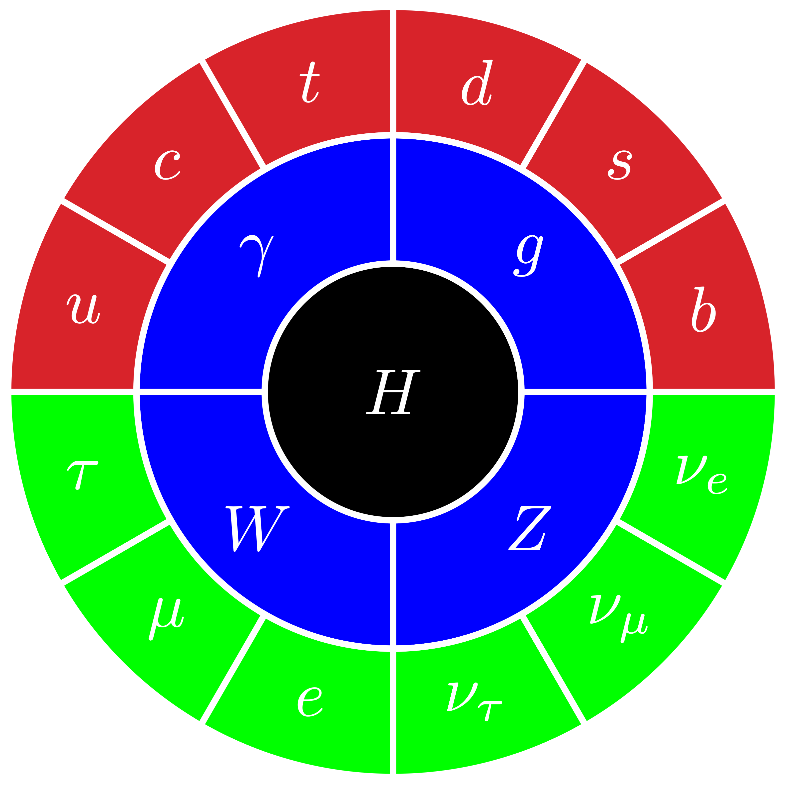

# Standard Model Graphic with TikZ

I love the graphic from [Particle Fever](http://www.particlefever.com). Some time ago I wrote a blog post about it entitled [A fresh look for the Standard Model](http://theoryandpractice.org/2013/08/a-fresh-look-for-the-standard-model/), and I've gotten to know Walter Murch in the process. I love the graphic in the movie, but I wasn't particularly happy with the fonts. I made my own version of the grahic with LaTeX fonts, but in keynote and that's used by several people. Recently I was playing with TikZ and realized that it's the perfect tool for making this figure. So here it is with a black and a transparent background. This is all open source, so you can edit or adapt it as you see fit. Maybe someone can even add the SUSY version with the Penrose tiles in the background (send a PR!).

 * [SM-transparent.pdf](SM-transparent.pdf)
 * [SM-transparent.png](SM-transparent.pdf)
 * [SM-black.pdf](SM-black.pdf)
 * [SM-black.png](SM-black.pdf)

## Some history
Here's a nice quote from the comments of that post:

> Mark Levinson says:
>
> August 10, 2013 at 11:16 pm
>
>As the director of Particle Fever, I want to say how gratifying it is to have elicited such a wonderful reaction to the film from the physics community. It was certainly a major goal for David and myself – as well as making a compelling story for everyone! The fact that the community has embraced “our” graphic for the Standard Model is icing on the cake.
>
>Just wanted to give some background on how that image came into being. It was actually our brilliant editor, Walter Murch, who had been obsessing about finding an iconic representation for the Standard Model equivalent to the Periodic Table. He wanted something that was accurate, meaningful, elegant and simple. One morning he came into the edit room and told me he had had a “benzene ring” dream – an idea for a circular representation of the SM. I think David and I may have suggested a couple of small modifications, but essentially it was the “artist” who trumped the physicists in devising what I hope becomes an iconic representation of the fundamental particles of physics!
